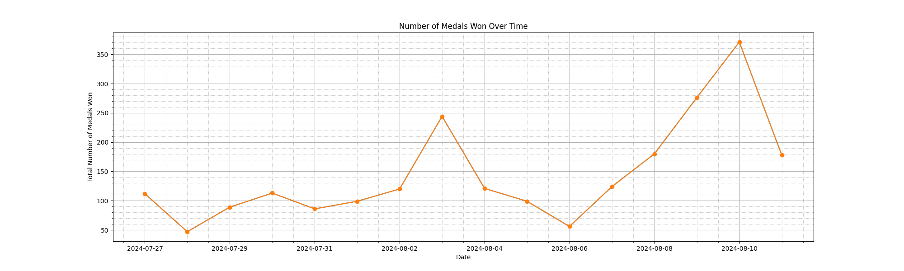
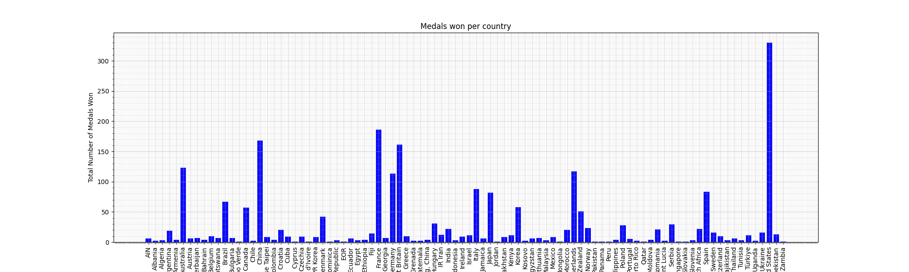

# Mini Project: Pandas Descriptive Statistics

Adil Keku Gazder   ag825, adil.gazder@duke.edu  IDS 706: Data Engineering Systems  Duke University, Fall 2024

The aim with this project was to read a .csv file and generate summary statistics and plots describing the data. The dataset used for this project was acquired from Kaggle (Olympic Summer Games - Paris 2024 -> medallists.csv)  

Link to the dataset: (https://www.kaggle.com/datasets/muhammadehsan02/olympic-summer-games-paris-2024?select=medallists.csv)

## Head of dataset used:
|    | medal_date   | medal_type   |   medal_code | name            | gender   | country_code   | country       | country_long   | nationality   |   team |   team_gender | discipline   | event                         | event_type   | url_event                                                                      | birth_date   |   code_athlete |   code_team |
|---:|:-------------|:-------------|-------------:|:----------------|:---------|:---------------|:--------------|:---------------|:--------------|-------:|--------------:|:-------------|:------------------------------|:-------------|:-------------------------------------------------------------------------------|:-------------|---------------:|------------:|
|  0 | 2024-07-27   | Gold Medal   |            1 | EVENEPOEL Remco | Male     | BEL            | Belgium       | Belgium        | Belgium       |    nan |           nan | Cycling Road | Men's Individual Time Trial   | ATH          | /en/paris-2024/results/cycling-road/men-s-individual-time-trial/fnl-000100--   | 2000-01-25   |        1903136 |         nan |
|  1 | 2024-07-27   | Silver Medal |            2 | GANNA Filippo   | Male     | ITA            | Italy         | Italy          | Italy         |    nan |           nan | Cycling Road | Men's Individual Time Trial   | ATH          | /en/paris-2024/results/cycling-road/men-s-individual-time-trial/fnl-000100--   | 1996-07-25   |        1923520 |         nan |
|  2 | 2024-07-27   | Bronze Medal |            3 | van AERT Wout   | Male     | BEL            | Belgium       | Belgium        | Belgium       |    nan |           nan | Cycling Road | Men's Individual Time Trial   | ATH          | /en/paris-2024/results/cycling-road/men-s-individual-time-trial/fnl-000100--   | 1994-09-15   |        1903147 |         nan |
|  3 | 2024-07-27   | Gold Medal   |            1 | BROWN Grace     | Female   | AUS            | Australia     | Australia      | Australia     |    nan |           nan | Cycling Road | Women's Individual Time Trial | ATH          | /en/paris-2024/results/cycling-road/women-s-individual-time-trial/fnl-000100-- | 1992-07-07   |        1940173 |         nan |
|  4 | 2024-07-27   | Silver Medal |            2 | HENDERSON Anna  | Female   | GBR            | Great Britain | Great Britain  | Great Britain |    nan |           nan | Cycling Road | Women's Individual Time Trial | ATH          | /en/paris-2024/results/cycling-road/women-s-individual-time-trial/fnl-000100-- | 1998-11-14   |        1912525 |         nan |

## Summary Statistics:
|       |   medal_code |     code_athlete |
|:------|-------------:|-----------------:|
| count |   2314       |   2315           |
| mean  |      2.02334 |      1.89332e+06 |
| std   |      0.82039 | 262828           |
| min   |      1       |      1.53287e+06 |
| 25%   |      1       |      1.89655e+06 |
| 50%   |      2       |      1.92446e+06 |
| 75%   |      3       |      1.9505e+06  |
| max   |      3       |      4.98e+06    |

## Distribution of total medals achieved totally over each day of the olympics

## Distribution of total medals achieved per each country
